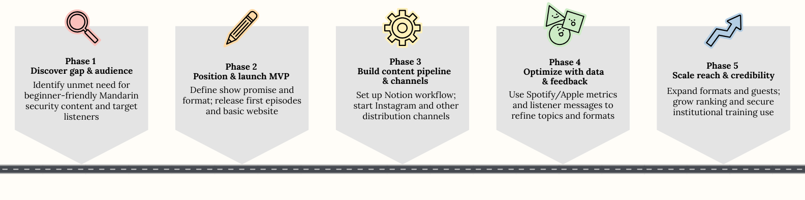
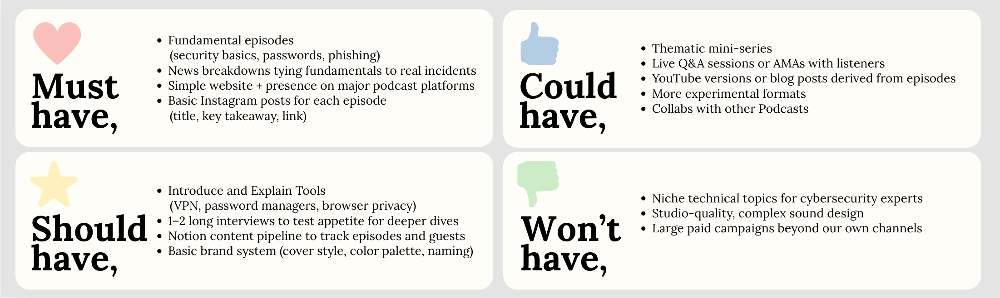
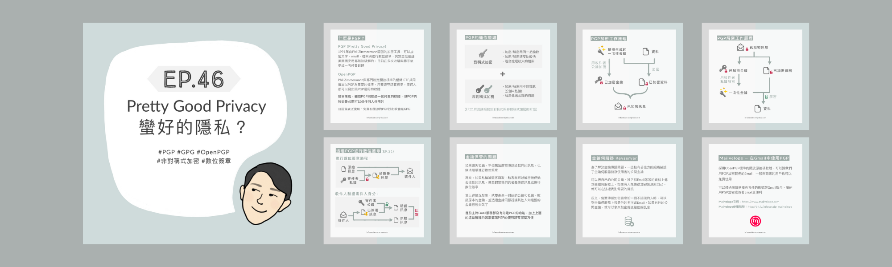
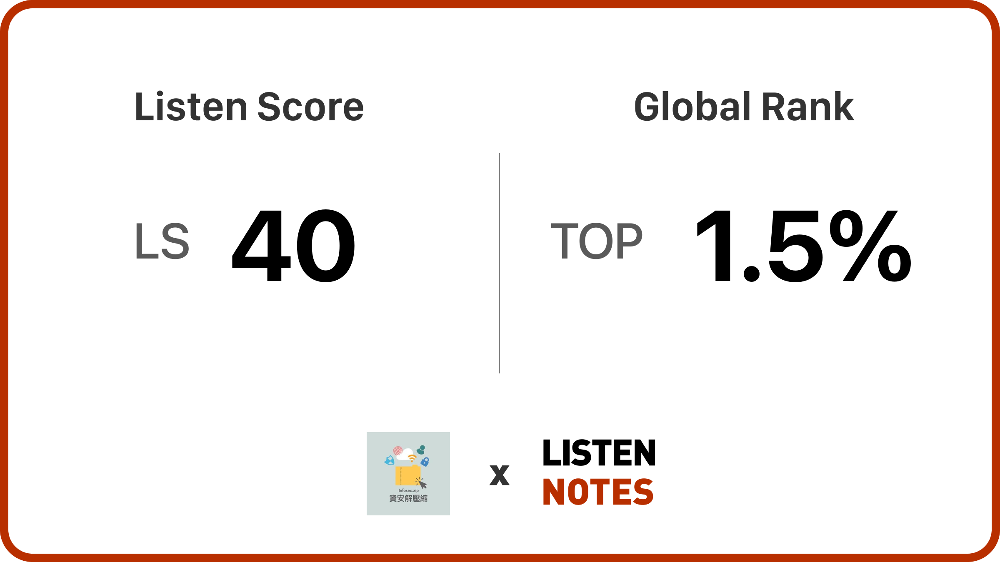

# InfosecDecompress Podcast: 0 to 1 Cybersecurity Education Product

InfosecDecompress is a Mandarin cybersecurity podcast that takes people from "I know nothing about security" to "I can explain this to others" using stories, visuals, and data-informed content decisions.

**Role:** Co-creator and Producer (2-person team). 
  - Shared ownership on content and product decisions
  - Led analytics, Notion pipeline, and Instagram strategy.

**Why this matters for PM:** End-to-end product experience from idea and audience discovery to positioning, content roadmap, analytics, and iteration.

**Key metrics**

| Metric | Value | Note |
|--------|-------|------|
| Global ranking | Top 1.5% | Listen Notes, ~3.6M shows |
| Avg. engagement rate (Apple) | 78% | Unique Engaged / Unique Listeners |
| Episodes | 54 | Fundamentals, news, tools, interviews |

---

### Process overview

At a high level, the podcast followed a simple product loop from discovery to iteration.

*High-level flow from identifying the content gap and audience, to defining the MVP and content strategy, building a content pipeline and guest workflow, launching on multiple channels, analyzing data and feedback, and iterating to grow reach.*

### Roadmap and phases

*Five phases from discovering the gap and audience, to positioning and launching the MVP, building the content pipeline and channels, optimizing with data and feedback, and finally scaling reach and credibility.*

## 1. Context and Problem

In 2020, interest in cybersecurity was growing among Mandarin speakers, but there were almost no accessible, beginner-friendly resources.

Most high-quality content was in English, and the Mandarin content that did exist was either very technical or very shallow.

This created a clear gap: many people wanted to understand how cybersecurity affected their work and everyday life, but the content they could find either drowned them in jargon or did not answer their real questions.

## 2. Mission and Target Audience

**Mission:**  
Make cybersecurity understandable and relevant for the general public by explaining key ideas in clear Mandarin with concrete, real-world examples.

**Target audience:**
- Mandarin-speaking audience with little or no security background
- People curious about topics like data leaks, phishing, and privacy, but who do not plan to become cybersecurity professionals 
- Later, a secondary audience: organizations and educators who needed approachable material for internal training

**Positioning:**  
An approachable, story-driven Mandarin cybersecurity show that sits between deep technical podcasts for experts and sensational headline-driven news.

## 3. Goals and Success Metrics

From the beginning, we treated InfosecDecompress as a product and defined what success should look like:

- **Reach:** steady growth in downloads and subscribers over time, not just a one-time launch spike
- **Engagement:** solid episode completion rates and a healthy share of listeners who come back for multiple episodes
- **Impact:** organizations reusing episodes for training and listeners saying they can explain topics to coworkers, friends, or family

To track this, we looked at episode downloads, completion rates, subscriber growth, traffic from Instagram and other channels, and inbound requests or messages from listeners and organizations.

When new ideas came up (ex. a new episode format or Instagram series), we compared options on three simple axes: ease of implementation, production effort, and expected impact on these core metrics. This helped us pick a clear starting point instead of trying to ship every idea at once.

## 4. Product Concept and Format

**Product idea:**  
Treat the podcast as a long-term product, not just a collection of episodes:
- Explain cybersecurity concepts in simple, concrete language
- Mix different episode types: fundamentals, news breakdowns, tool introductions, and interviews with people in different security roles
- Build a reusable library of episodes that organizations can also use as training material

**Format decisions:**
- **Language:** Mandarin, to remove the English barrier for most listeners
- **Length:** most episodes are around 10 minutes so people can fit them into a commute or short break; in-depth interviews run closer to an hour for listeners who want a deeper dive
- **Structure:** start with beginner-friendly topics and gradually go deeper, so new listeners can choose their own entry point
- **Guests:** invite practitioners from incident response, governance, engineering, and other roles to show what security work actually looks like day to day

## 5. 0 to 1: From Idea to Launch

**Discovery and validation:**
- Talked with friends, colleagues, and early listeners about how they currently learn about security and what confuses or scares them
- Reviewed popular English-language resources and listed topics that were missing or hard to find in Mandarin
- Ran small tests: short audio clips and outline ideas shared with a small group for feedback

**MVP definition:**
- A small set of core episodes explaining foundational concepts (for example, passwords, phishing, and basic network threats)
- One or two news-style episodes to connect these concepts to real incidents in the headlines
- A simple website and distribution setup so people could easily find episodes on major podcast platforms

**Launch and go-to-market:**
- Published on major podcast platforms plus a simple [website](https://infosecdecompress.com)
- Promoted the show in relevant communities and social channels where tech and security-curious listeners hang out
- Used [Instagram](https://www.instagram.com/infosec.zip) to share visuals, episode highlights, tools, and news updates, which became a key channel for bringing new listeners to the podcast
- Made episodes easy to share so listeners could recommend them to non-technical coworkers, friends, and family

### Prioritizing the first launch

We used a simple MoSCoW view to decide which episode types belonged in the initial launch: fundamentals and news breakdowns were **must‑have**, tool explainers and a few interviews were **should‑have**, while mini‑series, live Q&A, and cross‑podcast collaborations stayed in **could** or **won’t have for now**.

**Instagram as a growth channel:**

Instagram became one of our strongest acquisition and engagement channels:

- Created visual cards summarizing each episode's key points (for example, "3 things to check before using public Wi-Fi" or "common password patterns") so people could quickly understand the topic and decide whether to listen
- Posted multi-image explainers and simple infographics (such as tables of common passwords or diagrams of what data big platforms collect) to deliver value even for people who had not listened yet
- Ran occasional collaboration and campaign posts (for example, with [Hacks In Taiwan Conference (HITCON)](https://hitcon.org/) and other security events), which helped us reach new security-interested audiences
- Saw clear download bumps after well-performing posts, confirming that Instagram was one of our strongest channels for bringing in new listeners
- Kept a consistent visual system (same color palette, type, and layout for episode covers and infographics) so the brand was recognizable in the feed and listeners could immediately spot new episodes

  
*Instagram campaign for the [Audrey Tang](https://en.wikipedia.org/wiki/Audrey_Tang) (the first Minister of Digital Affairs of Taiwan) interview: one post introducing the episode and a follow-up series about her own cybersecurity tips.*

  
*Carousel explainer that walks through "what happens after you type a web address", repackaging the episode into a step-by-step visual story.*

  
*Episode cover and slides for "Pretty Good Privacy", using simple diagrams to explain how PGP works and making the topic approachable for non-experts.*

**How I evaluated ideas:**

When new episode or feature ideas came up, we compared a few options on three axes: ease of implementation, production effort, and expected impact on our core metrics (reach, engagement, and depth of impact).

This made it easier to pick a clear starting point for each season instead of trying to ship everything at once.

## 6. Iteration and Content Strategy

**Content roadmap:**  
After launching the first episodes, the content roadmap was driven by:
- Listener questions and messages
- Download numbers and completion rates for each episode
- Topics that sparked more discussion on social media

**Examples of iteration:**
- Expanded from fundamentals into deeper topics once data showed strong retention on beginner episodes and listeners were ready for more detail
- Added interviews with people in different security roles to answer the recurring question "what do security jobs actually look like day to day," and kept them as longer, roughly 1-hour conversations for listeners who wanted more detail
- Introduced tool walk-throughs and practical tips when listeners asked, "What can I actually do differently after listening?"

**Data-driven decisions:**
- Used Google Analytics and platform stats to see which topics, titles, and formats attracted more listeners and better completion rates
- Looked at trends over time to decide which themes to revisit, which to stop, and which to spin into mini-series
- Treated each season as a chance to try a few new ideas while keeping a familiar structure for returning listeners

When an episode or post under-performed, we ran a quick root-cause check: looked at topic, title, length, release timing, and how much we supported it on Instagram before deciding whether the issue was content, framing, or distribution. This kept us from overreacting to single metrics like "low plays" without understanding why.

## 7. Content and Guest Management

To keep quality high and publishing predictable, each episode ran through a simple production pipeline instead of one-off recordings.

**Content pipeline:**
- Used a Notion database to track every idea and episode through stages (idea, outline, recording, editing, review, scheduled, published), with one row per episode and columns for status, release date, script, social post, blog version, website update, and YouTube upload
- Stored metadata such as topic, episode type, audience level, difficulty, and related news so each season had a balanced mix and avoided repetition
- Linked episodes to notes on listener questions or metrics to see which ideas came directly from audience needs

**Guest workflow:**
- Kept a Notion list of potential guests, their roles, and the angle they could bring (for example, incident responder, policy maker, researcher)
- For each recording, prepared an interview outline with goals, key questions, and example stories, then shared it with the guest in advance
- Incorporated guest feedback into the outline and let them review sensitive sections before release to avoid misunderstandings while still keeping the content accessible

**Quality and consistency:**
- Used recording and editing checklists (audio quality, explaining jargon, clear takeaways or call-to-action) so episodes felt consistent even as topics and guests changed
- Managed release timing and mix of episode types (intro, deep dive, news, interview) to give both new and returning listeners a clear path through the library

This lightweight but structured process is very similar to managing a product backlog and release cadence: ideas are captured, prioritized, refined with stakeholders, and only shipped when they meet the quality bar.

  
*Notion content pipeline for InfosecDecompress, tracking each episode from idea to released across multiple channels.*

## 8. Outcomes and Impact

**Reach and recognition:**
- Grew InfosecDecompress into one of the earliest and leading Mandarin cybersecurity podcasts
- Selected by [Taiwan Academia Sinica](https://www.sinica.edu.tw/en) as internal training material for cybersecurity education
- Built enough credibility to attract guests across the ecosystem, including senior practitioners and public figures such as [Audrey Tang](https://en.wikipedia.org/wiki/Audrey_Tang)
- Ranked in the top 1.5 percent of podcasts globally by [Listen Notes](https://www.listennotes.com/podcasts/資安解壓縮-jeff-vQZzkFRCETb) (out of 3.6M+ shows, updated December 2025)

  

*Listen Notes score and global rank for InfosecDecompress (top 1.5% of podcasts worldwide).*

**Signals of product-market fit:**
- Steady growth in downloads and subscribers rather than a one-time spike
- Instagram became a strong acquisition channel: posts with episode highlights regularly drove noticeable bumps in new listeners
- Inbound requests from organizations asking to reuse episodes for internal training and onboarding
- Listeners reporting that episodes helped them explain security topics to coworkers, family members, or students

**Quantitative results:**
- Across 54 published episodes, achieved a 78.02% average engagement rate on Apple Podcasts, defined as Unique Engaged Listeners ÷ Unique Listeners (listeners who played at least 20 minutes or 40% of an episode).
- Identified “true product‑market fit” topics by combining Apple engagement with Spotify analytics: episodes about “what is information security”, password hygiene, VPNs, browser safety, and everyday device habits all landed in the top 20 for Spotify streams while keeping 80%+ engagement rate on Apple.
- Used this analysis to decide which topics to revisit as series, which formats to keep (short fundamentals vs. longer interviews), and which ideas to drop even if they had high clicks but weaker completion.

   

These signals together suggest real product–market fit for a Mandarin cybersecurity education product, not just a one-off content project.

## 9. Technology and Analytics

Even though this is a content product, tools and data played a big role.

**Stack and workflow:**
- Published and hosted on major podcast platforms plus a simple website (infosecdecompress.com)
- Used Google Analytics and social metrics to track where listeners came from and how they engaged
- Ran light text analysis and NLP on transcripts (for example, with NotebookLM) to:
  - Identify recurring themes and questions
  - Find segments that could be repurposed into articles, talks, or training modules
  - Map topic clusters to plan future episodes and series

This mix of qualitative feedback and quantitative data made content decisions feel very similar to product decisions: grounded in real user behavior instead of intuition alone.

**Implementation repos:**  
We host the [InfosecDecompress website](https://infosecdecompress.com) and related code in a [GitHub organization](https://github.com/Infosecdecompress), which includes the public site and supporting scripts.

## 10. Why This Experience Matters for Product Roles

InfosecDecompress is effectively a 0-to-1 product:

- **No existing template:** there was no established Mandarin cybersecurity show with this positioning, so the concept and brand had to be defined from scratch
- **Full lifecycle ownership:** from finding the problem and defining the audience through concept, launch, iteration, and basic go-to-market
- **Data-informed iteration:** topics and formats were adjusted based on real listener behavior and feedback, not just creative preference

For product and analytics PM roles, this shows comfort with ambiguity, the ability to find and validate a user problem, and the discipline to use data to guide what to build next.

## Contact

**Email:** cjcwork1@gmail.com  
**GitHub:** [github.com/chia-chang](https://github.com/chia-chang)

made with ✨ + 🌿 + 💛 by Chia Chang
