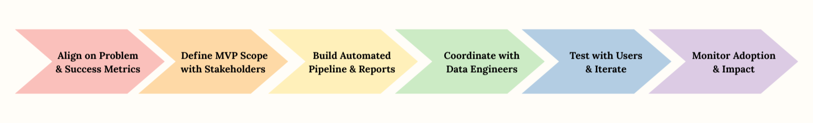

# COVID Analytics Automation: A Data Scientist’s Product Thinking

**Role:** Data Scientist at IBM. Owned analytics product design and implementation, working between epidemiologists and a data engineering team to turn manual reporting workflows into an automated system.

**Team Structure:**

- Overall COVID team: ~30 people
- Direct working group: 5 data engineers (each owning one data system: cases, testing, hospitalization, death, vaccination) coordinated by an IBM tech lead, 1 lead epidemiologist (primary client, interfacing with Mayor’s office)
- External partners: CDC collaborators, Brown University researchers

**What we built:** Automated COVID-19 reporting system that reduced manual work from 3–4 hours to 15 minutes per report, and became the default way teams generated daily updates.

**Why this matters for PM:** This work required product skills such as understanding users, prioritizing features, defining and tracking success metrics, and coordinating across multiple teams to deliver a unified solution.

**Key metrics:**

| Metric | Result | What it shows |
|--------|--------|---------------|
| Report prep time | 3–4 hours → 15 minutes per run | 80%+ reduction in manual effort |
| Daily users | 100K+ across internal teams, partners, and public dashboards | Broad adoption of the data product |
| Consistency | Single set of standardized metrics used across teams | Fewer conflicting numbers and reconciliation loops |
| Reliability signals | Users filed tickets quickly when the pipeline failed; other teams requested access | High dependence and pull from the organization |

## 1. Context and Problem

During the pandemic, operations and analytics teams spent several hours a day manually compiling COVID-19 reports from multiple systems. By the time a report was complete, the data was already out of date, and different teams sometimes reported conflicting numbers due to slightly different logic or queries.

At the same time, we needed to publish dashboards for the public and deliver tailored reports and charts for partners such as CDC collaborators, university researchers, and the press. That added more pressure on quality, consistency, and turnaround time.

The core problems were:

- **Time pressure:** slow, manual workflows delayed internal and external updates
- **Inconsistent definitions:** teams did not always calculate metrics in the same way
- **Limited scalability:** daily reporting was ideal, but manual work limited frequency

I treated this not just as a data science problem but as a product problem: what should the reporting experience look like if we redesigned it from the ground up.

## 2. Goals and Success Metrics

Before writing code, I worked with stakeholders to align on what “success” meant for this reporting system.

**Primary goal:**

- Reduce the time it takes to produce a standard COVID-19 report from several hours of manual work to well under 30 minutes per run

**Secondary goals:**

- Standardize key metrics so different teams no longer had to reconcile conflicting numbers
- Increase trust and adoption so that most internal and partner reports could rely on the same pipeline and definitions

**To track this, we focused on:**

- Report generation time for common workflows
- Adoption: number of teams and users regularly using the automated outputs
- Consistency and data quality: how often independent reports agreed on key metrics and how many corrections were needed compared with the manual process

## 3. Users and Needs

I mapped out several user groups and their needs.

**Primary user: epidemiologists and data analysts**

- Lose several hours a day assembling data in spreadsheets
- Need fast and reliable reports so they can focus on interpretation, not manual work
- Success: generate a report in under 30 minutes with minimal manual effort

**Secondary user: directors and managers**

- Make operational decisions using these reports
- Need confidence that metrics are defined consistently across teams
- Success: fewer reconciliation meetings and fewer “why do our numbers not match” conversations

**Tertiary user: external partners and public audiences**

- Examples: CDC collaborators, university researchers, journalists, and the general public using our dashboards
- Need: timely, clearly documented metrics and charts they can trust and reuse
- Success: can reference our site as a single, authoritative source without manual reconciliation

These personas shaped what the pipeline produced: detailed tables for analysts, concise views for leadership, and clear, ready-to-publish charts and dashboards for external audiences.

## 4. My Role and Approach

I owned the analytics product design and implementation for this project, acting as the bridge between stakeholders and the data engineering team:

**Primary Stakeholder - Lead Epidemiologist:**

- Brought requirements from Mayor’s office, usually driven by weekly press briefings
- I worked with them to discuss needs, prioritize features, and propose technical solutions
- Often identified manual processes in their workflow and suggested automation opportunities (which became the core of the 80% time reduction)

**Data Engineering Team (5 engineers, coordinated by an IBM lead):**

- Each engineer owned one data system (cases, testing, hospitalization, death, vaccination)
- I specified what data and formats I needed from each stream to build the integrated reports
- Worked with the team lead on prioritization and timelines

**External Partners:**

- CDC collaborators and Brown University researchers regularly requested custom datasets
- I scoped these requests, assessed feasibility, and coordinated delivery with the engineering team

**My day-to-day work included:**

- Requirements gathering and translation: turning epidemiological needs into technical specifications
- Solution design: proposing and implementing automation for manual workflows
- Hands-on development: building the core reporting pipeline and analytics products
- Cross-team coordination: making sure data from 5 different systems could integrate cleanly

The approach combined:

- **User research:** talking with analysts, operations staff, and leaders about their current workflows and where they lost time or trust
- **Proactive problem-solving:** identifying manual bottlenecks and proposing automated solutions
- **Iterative delivery:** treating each change as an experiment and using feedback and metrics to decide what to improve next

### Process overview

*End-to-end process from aligning on the problem and success metrics, to defining the MVP scope, building the automated pipeline and reports, coordinating with data engineers, testing with users, and monitoring adoption and impact.*

### Roadmap and phases

*Five phases from mapping manual pain and baseline, to defining the MVP and success, building the core pipeline and daily report, expanding outputs and validation, and rolling out while monitoring time savings, errors, and adoption.*

## 5. Solution Overview

At a high level, the system is an automated data product:

- Ingests COVID-19 data from several internal and external sources
- Cleans, validates, and standardizes the data
- Computes a consistent set of metrics such as cases, tests, positivity rate, rolling averages, and cumulative totals
- Generates multi-sheet Excel reports and chart bundles for internal users, plus refreshed dashboards for public and partner use on a schedule

**Impact highlights:**

- Around 80 percent reduction in reporting time (3-4 hours down to about 15 minutes)
- Dashboards and reports used by more than 100,000 daily users across organizations and the public
- Consistent metrics across teams and channels, which reduced confusion and rework

The core of the work was implemented in Python, but the key design decisions were driven by user needs and trade-offs, not only by technical elegance.

## 6. MVP and Prioritization

Instead of trying to ship a complete platform in one shot, I worked with the team to focus on getting a small but useful version into people’s hands quickly.

**For the first version, we scoped the work to:**

- Connect to the three most important data sources and automate ingestion
- Produce a single, reliable Excel report that could be refreshed with one command
- Start with a small set of core metrics: new cases, tests, and test positivity

**Several ideas were deliberately moved out of the first release:**

- Fully interactive dashboards and richer visual design
- Email alerts and subscription features
- Advanced modeling, such as short-term forecasts

**To decide what belonged in the first version, I used a simple impact versus effort lens:**

- High-impact and relatively low-effort items (the data pipeline and standardized calculations) went first
- High-impact but more complex items (multi-sheet reports, dashboards) were planned for later iterations
- Nice-to-have ideas (alerts, advanced formatting) were kept in a backlog for when the core workflow was stable

This structure made it possible to deliver a concrete, working product early, gather feedback from real use, and show that end-to-end automation was worth further investment.

Before committing to this plan, we compared several solution shapes (manual templates, semi-automated scripts, and a fully automated pipeline) on ease of implementation, engineering effort, and expected impact on report time. That exercise made it clear that a lean but fully automated pipeline was the best starting point, even if the visuals were simple at first.

## 7. Delivery and Iteration

We delivered the project in short cycles and treated each release as a chance to learn.

**The working cadence looked like this:**

- Two-week sprints with clear goals and defined deliverables
- Weekly demos for analysts and other stakeholders to react to work in progress
- Close collaboration with the data engineering team to turn user feedback into technical changes

**A few examples of changes driven directly by user feedback:**

- After the first release, analysts asked for a weekly view in addition to daily numbers, so I worked with the team to extend the report to include daily, weekly, and summary tabs
- When some users mentioned that certain values “felt off,” I coordinated with the engineering team to add data quality checks, source flags, and validation rules; this reduced support questions and increased trust in the outputs
- Executives said that they rarely opened spreadsheets, so we added a lightweight dashboard layer for them, while keeping the Excel reports for power users who preferred that format

One explicit trade-off was choosing a daily batch pipeline instead of near-real-time updates: it kept the system simple and reliable while still meeting users’ decision needs.

When numbers looked wrong, we did root-cause analysis on the pipeline rather than patching spreadsheets, and only shipped fixes once we knew exactly where the discrepancy came from.

In other words, the roadmap was shaped by actual usage and conversations, not just by an initial requirements document.

## 8. Stakeholder Management

The work sat in the middle of several groups with different priorities, so a big part of my job was keeping everyone aligned.

**Operations and analytics teams**

- Focus: reliability and time savings in their daily workflow
- How I worked with them: regular demos, short documentation, and an easy way to report issues and requests

**Data engineering team**

- Focus: clear requirements and a scoped, maintainable solution
- How I worked with them: structured specifications, acceptance criteria, and clear signal on what was truly “must have”

**Executives and leadership**

- Focus: impact, risks, and how the system supported critical decisions
- How I worked with them: simple updates on hours saved, adoption, and examples of decisions enabled by faster reporting

**Public health experts and research partners**

- Focus: methodological soundness and interpretability of metrics
- How I worked with them: joint work on metric definitions and validation against external standards and benchmarks

Coordinating these perspectives and translating between them often took as much effort as writing code, and it reinforced how central communication is in any product-like role.

## 9. Outcomes and Impact

By the time the system was fully adopted, our team had:

- Cut report time from 3-4 hours to about 15 minutes per run
- Supported 100K+ daily users across internal teams, partners, and public dashboards
- Reduced errors and conflicting numbers across teams, making our reports the single source of truth

**Primary success metric:**

- Time required to generate a standard report
  - Before automation: roughly 3-4 hours of manual effort
  - After automation: about 15 minutes

**Supporting metrics:**

- Adoption: number of teams and users using the automated reports on a regular basis
- Consistency: how often independent reports agreed on key metrics after standardization
- Data quality: error rates and number of corrections compared with the manual process

**Qualitative signals:**

- Users raised tickets quickly when the pipeline failed, which showed that they depended on it
- Other teams requested access and asked for similar automation for their own workflows
- Stakeholders described it as hard to imagine returning to the pre-automation process

Taken together, these signals matched what is usually seen when an internal data product reaches real traction: frequent use, reliance, and inbound demand for extensions.

**My contribution:** Owned analytics product design and implementation, working with the epidemiologist to identify automation opportunities and with 5 data engineers to build an integrated system that became the organization’s single source of truth for COVID data.

## 10. Technical Implementation

**High-level architecture:**  
Data sources → Ingestion → Processing → Storage → Reports, Charts, and Dashboards

**Tech stack:**

- Python with Pandas and NumPy for data processing and metric calculation
- CSV-based storage in the earliest stage, later migrated to PostgreSQL as data volume and complexity grew
- OpenPyXL and related libraries for generating Excel outputs and chart bundles
- Matplotlib and dashboard tools such as Looker Studio and Datawrapper for visualizations consumed by internal and external audiences

**Key technical choices:**

- Start with simple file-based storage to validate the workflow quickly, then move to a relational database once requirements and traffic justified it
- Treat report generation as a repeatable, testable step in the pipeline rather than a one-off script
- Produce multiple output formats from the same underlying data so that analysts, leadership, and public users all saw a consistent view

**For detailed code and implementation:**  
See the [technical repository](https://github.com/chia-chang/covid-analytics-automation) with sample notebooks, data pipeline, and report generation examples.

## Contact

**Email:** cjcwork1@gmail.com  
**GitHub:** [github.com/chia-chang](https://github.com/chia-chang)

made with ✨ + 🌿 + 💛 by Chia Chang
