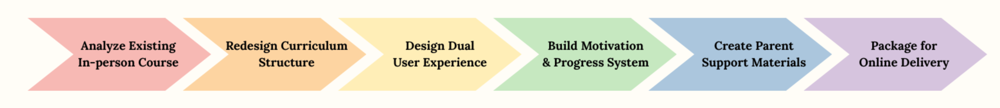
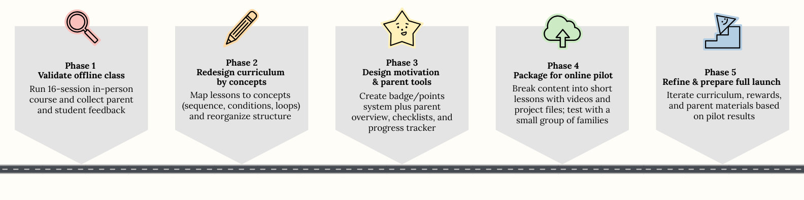
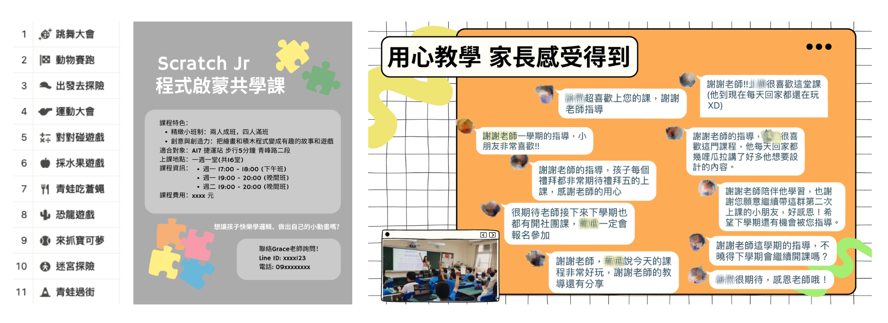

# Scratch Jr Programming Course: From Classroom to Online Curriculum

**Role:** Curriculum and product co‑designer for the online version (2-person team). I helped redesign the course structure, motivation system, and parent experience based on an existing in‑person class.

**What I’m building:** A Mandarin Scratch Jr programming course for kids (ages 5–7) that can be delivered in short, modular lessons.

**What I changed:**
- Reorganized the lesson list around concepts (Basics → Sequence → Conditions → Loops → Integration projects) instead of only themes like “dance party” or “animal race”.  
- Defined for each lesson: the main project, core concept, and how it builds on previous blocks, so kids can later find and review specific ideas.  
- Designed a lightweight points-and-badges system that families can run at home to keep kids engaged in a self-paced online course.  
- Created simple parent-facing artifacts (one-page overview, unit checklists, progress tracker) so parents know what each lesson teaches and how to support practice.

**Why this matters for PM:** Shows how to turn a one‑teacher class into a clearer, more scalable learning product by structuring concepts, designing engagement loops, and serving both kids and parents as users.

## 1. Context and Problem

Many parents want their kids to “learn programming”, but most materials for 5–7 year‑olds are either:
- Too abstract and text‑heavy  
- A set of fun activities without a clear learning path or sense of progress  

My collaborator is an experienced children’s coding instructor who already ran a popular in‑person Scratch Jr class. The challenge was to turn her classroom experience into a reusable curriculum that could later live online, while keeping kids engaged and giving parents a better view of what their child is learning.

Her offline class had strong engagement and positive parent feedback, but most of the structure lived in her head. I joined to help turn this into a clearer learning path and an online‑ready curriculum.

## 2. Mission and Target Audience

**Mission:**  
Help young children build confidence with programming concepts through stories, animations, and games, not through syntax or exams.

**Target audience:**
- Kids aged 5–7 (extendable up to 10) with no prior coding experience  
- Parents who want something structured and playful, and who often stay involved as learning partners  

## 3. Goals and Success Metrics

Because the online version is still in progress, goals focus on learning experience rather than revenue:   
•	**Kids**: Understand and reuse concepts like sequence, conditions, and loops, not just follow step‑by‑step instructions.   
•	**Parents**: Quickly see what each unit teaches and know how to review or practice with their child.   

To support this, the curriculum design emphasizes:  
•	A visible progression of concepts (from basic blocks to sequences, then conditions and loops).   
•	Clear mapping between each lesson and the core concept it teaches.   
•	Artifacts that kids can show and explain to parents (projects, badges, and a simple progress record).

## 4. My Approach and Role

I joined after the in‑person course structure already existed and focused on:   
•	Making the curriculum explicit: Turning the instructor’s lesson notes into a structured map of lessons, project files, and core concepts.   
•	Designing for reuse and review: Grouping lessons by concepts so kids and parents can easily find “all the lessons about loops” or “where we first introduced conditions”.   
•	Adding a motivation system for online learning: Designing points and badges that work without a live teacher in the room, so families can keep kids engaged over several weeks.    

I did not design or run the original classroom sessions. Instead, I treated them as an MVP that had already validated demand and engagement, and focused on the “productization” step needed to scale beyond one teacher and one classroom.

### Process overview

*High-level steps from analyzing the existing in‑person course, to redesigning the curriculum structure, designing the dual user experience for kids and parents, building the motivation and progress system, creating parent support materials, and packaging the course for online delivery.*

### Roadmap and phases

*Five phases from validating the offline class, to redesigning the curriculum by concepts, designing motivation and parent tools, packaging lessons for an online pilot, and refining everything for a full launch based on pilot results.*

## 5. Classroom Course Design (Existing Offline Version)

The instructor’s original class is a 16‑session, in‑person course, taught in Mandarin, where each session ends with an animation or mini‑game that kids can show their parents. The screenshots below show the initial lesson list and Notion table we used as raw material.

Key characteristics of the offline course:   
•	Small group format with strong engagement and positive parent feedback.   
•	Each lesson has a themed project (for example, dance party, animal race, monster chase) designed to keep kids excited.   
•	Concepts such as moving blocks, speed, events, and simple conditions are taught implicitly as part of following teacher instructions.   

This version worked well in person, but it was hard for parents or other teachers to see the overall progression or reuse specific lessons.   

### Evidence from the original classroom course

*Lesson list, flyer and parent feedback from the original in‑person Scratch Jr class, which validated demand and became the foundation for the online, structured curriculum I worked on.*

## 6. Redesigning the Curriculum Structure
My first step was to reorganize the lessons around concepts instead of only themes. I rebuilt the lesson list into a table with columns such as:   
•	Lesson number and name.   
•	Main activity / project file.   
•	Core programming concept (Basics, Sequence, Condition, Loop, Project Integration).   
•	Related questions or prompts for discussion.   
From there, I proposed a new structure that:   
•	Starts with **basic operations** (open app, create characters, move, run scripts).   
•	Moves into **sequencing** (ordering blocks so actions happen in the right order).   
•	Introduces **conditional logic** (reacting to events or collisions).   
•	Adds **loops** (repeating patterns without copying blocks).   
•	Ends with **integration projects** where kids combine multiple concepts in their own stories.   
Right now, the detailed design is complete up to the early units, and the later units are planned as creative projects that combine earlier blocks rather than fixed step‑by‑step builds.

## 7. Motivation and Reward System (Online‑Friendly)
Because online lessons can be watched at any time, a big risk is that families “mean to start” but never build a habit. To support this, I designed a simple points and badges system that families can run themselves.
At a high level, the system has:
•	**Points** for completing lesson videos, projects, and extra remixes.
•	**Badges** for concepts (sequence, condition, loop), consistency, and creativity.
•	A printable reward poster and badge sheet that parents can put on the fridge and customize with their own prizes.
The visuals and concrete rules are in the appendix section below.

### Printable Reward System Artifacts
To make the motivation system easy to run at home, I designed two printable artifacts:
•	**Reward poster**: Explains how to earn points, how many points each badge is worth, and example rewards families can customize.
•	**Achievement badges sheet**: A set of reusable badge icons that kids can mark off or sticker over as they reach milestones.
These are designed so parents can adjust rewards (screen time, small toys, outings) without changing the core structure of the system.

## 8. Parent Experience

For parents, I designed lightweight but concrete artifacts:   
•	A one‑page course overview that explains the goals, high‑level structure, and what Scratch Jr is.   
•	Short checklists per unit (“can start a project”, “can run a script”, “can explain what a loop does”).   
•	A simple progress tracker that parents can print or keep digitally to mark completed lessons and badges.   
The goal is to make the course feel structured and purposeful rather than “random YouTube videos about coding”.

## 9. Moving Toward an Online Curriculum (In Progress)
The current plan for the online version is:   
•	Break the in‑person 16‑session course into shorter, focused video lessons.    
•	Package each lesson with:   
  •	A short Mandarin video walkthrough.   
  •	A Scratch Jr project file (.sjr) as a starting point.     
  •	Parent notes and suggested questions to ask their child.   
•	Keep the motivation system printable or digital so families can run it without extra tools.   

This is still in progress; the work so far focuses on curriculum architecture, concept mapping, and the reward system rather than full production of all videos.

## 10. How This Relates to Product Roles

This project demonstrates:   
•	Taking an existing, successful “service” (one teacher’s live class) and turning it into a reusable, structured product.   
•	Designing for multiple users with different needs: kids, parents, and the instructor.   
•	Balancing pedagogy and product thinking: defining concepts, shaping the curriculum, and planning for engagement in an online, self‑paced format.   
It complements the InfosecDecompress podcast case study by showing similar product skills in a very different domain: early‑childhood programming instead of adult cybersecurity content.

## Appendix: Printable Materials

- Course overview one‑pager (for parents)  
- Unit checklists and progress tracker  
- Scratch Jr reward poster and badge sheet (for kids’ motivation)

## Contact

**Email:** cjcwork1@gmail.com  
**GitHub:** [github.com/chia-chang](https://github.com/chia-chang)  

made with ✨ + 🌿 + 💛 by Chia Chang
